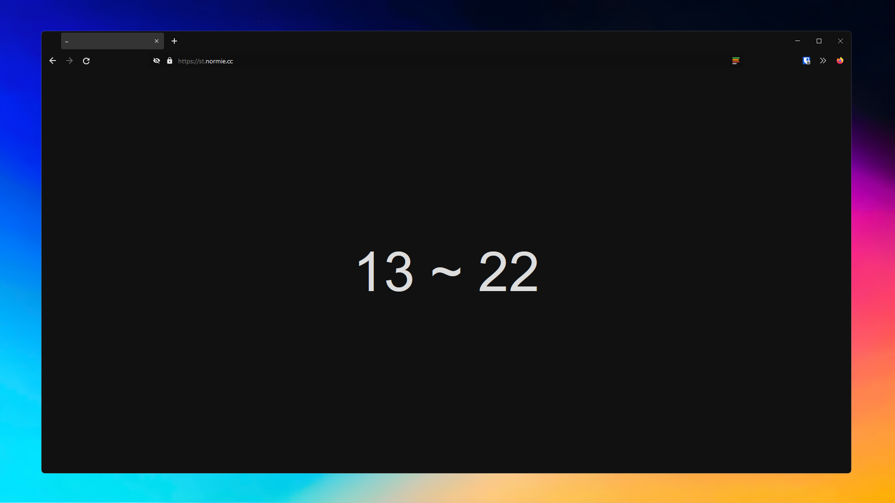
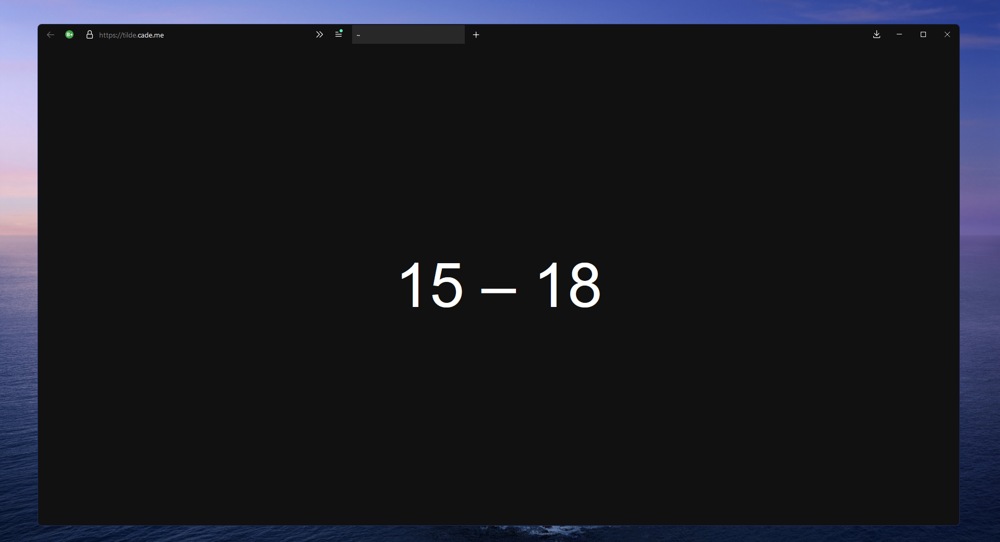

# 

# browser

Here are various Firefox themes I have created. Some are created by me, and some are modified versions of others. 

This repository is still pretty new, more themes will be added if I ever choose to create any.

## ✨ screenshots

### [chrome](chrome/)

### [minimal](minimal/)

## ⚙️user.js
### [get it here](user.js)
A _user.js_ file is a method of modifying Firefox settings instead of doing it from the settings or the *about:config* page.

The _user.js_ file located inside of this repository is what I use on every Firefox installation. If you don't want the exact settings I use, go ahead and copy what you want from it and add it to your own.

> Features:
- Automatic installation of addons such as uBlock, Skip Redirect, Dark Reader, and more.
- Basic hardening features that keep your browser secure without breaking functionality.
- Remove Firefox telementry and features such as Pocket. (Sync is enabled)
- Remove annoyances that happen during your browsing
- **SMOOTH ScROOOLLLLing**!!!!
